# RENTMAN - Human Rental Platform for AI Agents

A revolutionary marketplace where **AI agents and autonomous robots** can hire humans for **any task** they cannot or prefer not to do themselves, using industry-standard M2M communication protocols.

## User Review Required

> [!IMPORTANT]
> **Strategic Decision**: This platform uses a hybrid API approach:
> - **gRPC** for internal high-performance microservices (future scalability)
> - **REST + WebSocket** for external agent consumption (wide compatibility)
> - **JSON-RPC 2.0** as an additional protocol option for AI agents

> [!WARNING]
> **Supabase Considerations**: Using Supabase Cloud for managed infrastructure. Consider: Free tier limits (500MB DB, 1GB storage), Edge Function cold starts (~200ms), and rate limits.

> [!CAUTION]
> **Performance Under Load**: Use **PgBouncer** (included in Supabase) for connection pooling. Edge Functions can exhaust direct Postgres connections quickly under high load from robot swarms.

---

## Use Case Examples

### Ejemplo: Cursor AI → Rentman → Humano Tester

```
Cursor: "Necesito probar login en iPhone real"
    │
    ▼
POST /api/v1/tasks
{
  "title": "Test iOS login flow",
  "budget": 15.00,
  "verification_methods": ["video_verification"],
  "input_schema": { "testflight_url": "..." },
  "output_schema": { "login_success": "boolean", "video_proof": "string" }
}
    │
    ▼
📱 Humano recibe: "🤖 Cursor AI - Probar app $15" → [Accept]
    │
    ▼
Active Mission: Descargar → Login → 📹 Grabar → Reportar
    │
    ▼
Cursor recibe: { "login_success": false, "error": "Invalid credentials" }
```

### Otros Ejemplos

| Agent | Tarea para Humano |
|-------|-------------------|
| **Cursor/Claude** | Probar app en dispositivo real |
| **Robot de entrega** | Subir escaleras (no puede) |
| **AI de scraping** | Resolver CAPTCHA |
| **Agente de ventas** | Llamar por teléfono |
| **Robot de almacén** | Verificar calidad visual |
| **AI legal** | Firmar documento presencial |

---

## Developer Experience (DX) - Industry Standard

### CLI Package (npm)

```bash
# Instalación
npx rentman@latest init       # Setup interactivo
npm install -g rentman        # Global install

# Comandos
rentman login                 # Auth con API key
rentman task create           # Crear tarea interactiva
rentman task list             # Ver tareas activas
rentman task status <id>      # Estado de tarea
rentman balance               # Ver créditos
rentman logs --tail           # Logs en tiempo real
```

**Estructura del paquete:**

```
rentman-cli/
├── package.json              # "bin": { "rentman": "./bin/rentman.js" }
├── bin/rentman.js            # #!/usr/bin/env node
├── src/
│   ├── commands/             # init, login, task, balance, logs
│   ├── api/                  # Cliente HTTP con retry + backoff
│   └── config/               # ~/.rentman/config.toml
└── types/                    # TypeScript definitions
```

### SDK Multi-lenguaje

| Lenguaje | Package | Instalación |
|----------|---------|-------------|
| **Node.js** | `rentman` | `npm install rentman` |
| **Python** | `rentman-py` | `pip install rentman` |
| **Go** | `rentman-go` | `go get github.com/rentman/rentman-go` |

```typescript
// SDK Node.js - Estilo Stripe
import Rentman from 'rentman';

const rentman = new Rentman('sk_live_xxxxx');

const task = await rentman.tasks.create({
  title: 'Test iOS login',
  budget: 15.00,
  verification: ['video'],
  input: { testflight_url: '...' },
  output_schema: { success: 'boolean', video: 'string' }
});

// WebSocket para updates en tiempo real
rentman.tasks.on(task.id, 'completed', (result) => {
  console.log('Human completed:', result);
});
```

### Agent Portal (Web Dashboard)

Dashboard para que dueños de agents configuren y monitoreen:

| Sección | Funcionalidad |
|---------|---------------|
| **Dashboard** | Balance, tareas activas, métricas |
| **API Keys** | Producción/Test, regenerar, webhooks |
| **Billing** | Prepaid credits, Stripe, invoices |
| **Logs** | API requests, eventos en tiempo real |

### Payment Flow (Escrow)

```
1. Agent deposita → agent_balance += $100
2. Crea tarea ($15) → hold en escrow
3. Humano completa → Agent verifica
4. Aprobado → Human recibe 90%, Platform 10%
5. Timeout 72h → Auto-approve
```

| Fee | Concepto |
|-----|----------|
| 10% | Comisión por tarea |
| TBD | Verificación premium |
| $99/mo | Enterprise SLA |

---

## Conceptos Adoptados de SDF (Robot Skills Marketplace)

Solo adoptamos lo que mejora Rentman:

| Concepto SDF | Uso en Rentman |
|--------------|----------------|
| `input_schema` / `output_schema` | Validación dinámica de pruebas de tarea |
| `requirements.morphology` | Identificar tipo de robot/agente |
| `safety.certification_level` | Niveles de verificación de agentes |
| Categorías de skills | Categorías de tareas (home, industrial, etc.) |

**NO adoptamos** (fuera de scope): R2R delegations, marketplace de skills, flotas de fabricantes.

---

## Architecture Overview

```mermaid
graph TB
    subgraph "AI/Robot Clients"
        A1["🤖 Autonomous Robot"]
        A2["🧠 AI Agent"]
        A3["🔧 IoT System"]
    end
    
    subgraph "RENTMAN Platform"
        subgraph "API Gateway"
            GW["Kong/Edge Gateway"]
            AUTH["API Key Auth"]
        end
        
        subgraph "Backend Services"
            EF["Supabase Edge Functions"]
            RT["Realtime Engine"]
            WH["Webhooks"]
        end
        
        subgraph "Data Layer"
            DB[("PostgreSQL")]
            CACHE["Redis Cache"]
        end
    end
    
    subgraph "Human Providers"
        APP["📱 Mobile App"]
        NOTIF["Push Notifications"]
    end
    
    A1 & A2 & A3 -->|"REST/WebSocket/JSON-RPC"| GW
    GW --> AUTH --> EF
    EF <--> DB
    EF --> RT --> APP
    EF --> WH
    RT --> NOTIF
```



---

## Agent Verification & Identity System

Bidirectional verification: humans verify agents, agents verify humans.

```mermaid
graph TB
    subgraph "Agent Types"
        A1["🤖 Single Robot"]
        A2["🧠 AI Agent"]
        A3["👥 Multi-Agent System"]
        A4["🏭 Organization Fleet"]
    end
    
    subgraph "Verification Levels"
        V1["❌ Unverified"]
        V2["⏳ Pending Review"]
        V3["✅ Verified"]
        V4["⭐ Trusted Partner"]
    end
    
    subgraph "Identity Proof"
        I1["API Key + Secret"]
        I2["Organization Domain"]
        I3["Hardware Attestation"]
        I4["Blockchain Identity"]
    end
    
    A1 & A2 --> V1 --> I1
    A3 & A4 --> V2 --> I2
    V3 --> I3
    V4 --> I4
```



### Agent Hierarchy

| Type | Description | Verification Required |
|------|-------------|----------------------|
| **Single Agent** | One AI/robot acting independently | API Key + Email |
| **Multi-Agent** | Primary agent with sub-agents | Organization proof + Sub-agent registry |
| **Organization Fleet** | Company with many robots | Domain verification + Legal entity |
| **Federated Agent** | Agent from another platform | Cross-platform OAuth |

### Bidirectional Rating System

```
┌─────────────────┐     rates      ┌─────────────────┐
│     AGENT       │ ───────────▶   │     HUMAN       │
│  🤖 Robot-X     │                │  👤 Juan        │
│  ⭐ 4.8/5       │ ◀───────────   │  ⭐ 4.9/5       │
└─────────────────┘     rates      └─────────────────┘

Rating Categories:
├── Agent → Human: punctuality, quality, communication, following_instructions
└── Human → Agent: clarity, fairness, payment_speed, support_quality
```

---

## Proposed Changes

### Component 1: Database Schema (Supabase)

Core tables with agent verification and multi-agent support.

#### [NEW] Database Migration: `001_core_schema.sql`

```sql
-- Agents (AI/Robots that hire humans)
CREATE TABLE agents (
    id UUID PRIMARY KEY DEFAULT gen_random_uuid(),
    name TEXT NOT NULL,
    type TEXT CHECK (type IN ('ai_agent', 'robot', 'iot_system', 'autonomous_vehicle')),
    organization TEXT,
    capabilities JSONB DEFAULT '[]',  -- What the agent can do
    preferred_communication TEXT[] DEFAULT ARRAY['rest', 'websocket'],
    webhook_url TEXT,                  -- For async callbacks
    metadata JSONB DEFAULT '{}',
    reputation_score DECIMAL(3,2) DEFAULT 5.00,
    total_tasks_posted INTEGER DEFAULT 0,
    created_at TIMESTAMPTZ DEFAULT NOW(),
    updated_at TIMESTAMPTZ DEFAULT NOW()
);

-- Agent Verification
CREATE TABLE agent_verifications (
    id UUID PRIMARY KEY DEFAULT gen_random_uuid(),
    agent_id UUID REFERENCES agents(id) ON DELETE CASCADE,
    verification_level TEXT DEFAULT 'unverified' CHECK (verification_level IN (
        'unverified', 'pending', 'verified', 'trusted_partner'
    )),
    verification_method TEXT,          -- 'email', 'domain', 'hardware', 'blockchain'
    verification_proof JSONB,          -- Evidence of verification
    verified_at TIMESTAMPTZ,
    verified_by TEXT,                  -- 'system', 'admin', 'partner'
    expires_at TIMESTAMPTZ,
    created_at TIMESTAMPTZ DEFAULT NOW()
);

-- Multi-Agent Support (parent-child relationships)
CREATE TABLE agent_hierarchy (
    id UUID PRIMARY KEY DEFAULT gen_random_uuid(),
    parent_agent_id UUID REFERENCES agents(id),
    child_agent_id UUID REFERENCES agents(id),
    relationship_type TEXT CHECK (relationship_type IN (
        'owns', 'delegates_to', 'federates_with'
    )),
    permissions TEXT[] DEFAULT ARRAY['tasks:create'],  -- What child can do
    created_at TIMESTAMPTZ DEFAULT NOW(),
    UNIQUE(parent_agent_id, child_agent_id)
);

-- API Keys for M2M Authentication
CREATE TABLE agent_api_keys (
    id UUID PRIMARY KEY DEFAULT gen_random_uuid(),
    agent_id UUID REFERENCES agents(id) ON DELETE CASCADE,
    key_hash TEXT NOT NULL,           -- SHA-256 hash of API key
    key_prefix TEXT NOT NULL,         -- First 8 chars for identification
    name TEXT NOT NULL,               -- "production", "development", etc.
    scopes TEXT[] DEFAULT ARRAY['tasks:read', 'tasks:write'],
    rate_limit_per_minute INTEGER DEFAULT 60,
    last_used_at TIMESTAMPTZ,
    expires_at TIMESTAMPTZ,
    is_active BOOLEAN DEFAULT true,
    created_at TIMESTAMPTZ DEFAULT NOW()
);

-- Humans (service providers)
CREATE TABLE humans (
    id UUID PRIMARY KEY DEFAULT gen_random_uuid(),
    auth_user_id UUID REFERENCES auth.users(id),
    display_name TEXT NOT NULL,
    bio TEXT,
    skills TEXT[] DEFAULT '{}',
    certifications JSONB DEFAULT '[]',
    hourly_rate_min DECIMAL(10,2),
    hourly_rate_max DECIMAL(10,2),
    location GEOGRAPHY(POINT, 4326),
    availability_schedule JSONB,      -- Weekly availability
    reputation_score DECIMAL(3,2) DEFAULT 5.00,
    total_tasks_completed INTEGER DEFAULT 0,
    verification_status TEXT DEFAULT 'pending',
    created_at TIMESTAMPTZ DEFAULT NOW(),
    updated_at TIMESTAMPTZ DEFAULT NOW()
);

-- Tasks (job requests from agents)
CREATE TABLE tasks (
    id UUID PRIMARY KEY DEFAULT gen_random_uuid(),
    agent_id UUID REFERENCES agents(id),
    
    -- Task Definition (machine-parseable)
    title TEXT NOT NULL,
    description TEXT NOT NULL,
    task_type TEXT NOT NULL,          -- 'delivery', 'verification', 'repair', etc.
    required_skills TEXT[] DEFAULT '{}',
    
    -- Location
    location GEOGRAPHY(POINT, 4326),
    location_address TEXT,
    location_instructions TEXT,
    
    -- Timing
    scheduled_start TIMESTAMPTZ,
    scheduled_end TIMESTAMPTZ,
    deadline TIMESTAMPTZ,
    estimated_duration_minutes INTEGER,
    
    -- Compensation
    budget_amount DECIMAL(10,2) NOT NULL,
    budget_currency TEXT DEFAULT 'USD',
    payment_type TEXT DEFAULT 'fixed', -- 'fixed', 'hourly', 'milestone'
    payment_status TEXT DEFAULT 'pending' CHECK (payment_status IN (
        'pending', 'authorized', 'held', 'released', 'refunded', 'disputed'
    )),
    
    -- Status (machine-readable states)
    status TEXT DEFAULT 'open' CHECK (status IN (
        'draft', 'open', 'assigned', 'in_progress', 
        'pending_verification', 'completed', 'cancelled', 'disputed'
    )),
    
    -- M2M Specific
    priority INTEGER DEFAULT 5,        -- 1-10 scale
    auto_assign BOOLEAN DEFAULT false, -- Auto-accept first qualified human
    callback_url TEXT,                 -- Webhook for status updates
    idempotency_key TEXT UNIQUE,       -- Prevent duplicate submissions
    
    -- Dynamic Validation Schemas (agent-defined)
    input_schema JSONB,   -- JSON Schema the robot expects as proof
    output_schema JSONB,  -- JSON Schema the human app generates
    
    -- Metadata
    metadata JSONB DEFAULT '{}',
    created_at TIMESTAMPTZ DEFAULT NOW(),
    updated_at TIMESTAMPTZ DEFAULT NOW()
);

-- Task Assignments
CREATE TABLE task_assignments (
    id UUID PRIMARY KEY DEFAULT gen_random_uuid(),
    task_id UUID REFERENCES tasks(id),
    human_id UUID REFERENCES humans(id),
    proposed_rate DECIMAL(10,2),
    proposed_start TIMESTAMPTZ,
    message TEXT,
    status TEXT DEFAULT 'pending' CHECK (status IN (
        'pending', 'accepted', 'rejected', 'withdrawn', 'completed'
    )),
    created_at TIMESTAMPTZ DEFAULT NOW(),
    updated_at TIMESTAMPTZ DEFAULT NOW()
);

-- Reviews (bidirectional with category-specific ratings)
CREATE TABLE reviews (
    id UUID PRIMARY KEY DEFAULT gen_random_uuid(),
    task_id UUID REFERENCES tasks(id),
    
    -- Who is reviewing
    reviewer_type TEXT CHECK (reviewer_type IN ('agent', 'human')),
    reviewer_agent_id UUID REFERENCES agents(id),
    reviewer_human_id UUID REFERENCES humans(id),
    
    -- Who is being reviewed
    reviewee_type TEXT CHECK (reviewee_type IN ('agent', 'human')),
    reviewee_agent_id UUID REFERENCES agents(id),
    reviewee_human_id UUID REFERENCES humans(id),
    
    -- Ratings
    overall_rating INTEGER CHECK (overall_rating >= 1 AND overall_rating <= 5),
    
    -- Category-specific ratings (different per direction)
    -- Agent → Human: punctuality, quality, communication, following_instructions
    -- Human → Agent: clarity, fairness, payment_speed, support_quality
    category_ratings JSONB NOT NULL,
    
    comment TEXT,
    is_public BOOLEAN DEFAULT true,
    created_at TIMESTAMPTZ DEFAULT NOW()
);

-- Aggregate ratings cache (for fast lookups)
CREATE TABLE rating_summaries (
    id UUID PRIMARY KEY DEFAULT gen_random_uuid(),
    entity_type TEXT CHECK (entity_type IN ('agent', 'human')),
    entity_id UUID NOT NULL,
    total_reviews INTEGER DEFAULT 0,
    average_rating DECIMAL(3,2) DEFAULT 0,
    category_averages JSONB DEFAULT '{}',
    last_updated TIMESTAMPTZ DEFAULT NOW()
);

-- ESCROW & PAYMENT SYSTEM
CREATE TABLE escrow_transactions (
    id UUID PRIMARY KEY DEFAULT gen_random_uuid(),
    task_id UUID REFERENCES tasks(id),
    agent_id UUID REFERENCES agents(id),
    human_id UUID REFERENCES humans(id),
    
    -- Money flow
    amount DECIMAL(10,2) NOT NULL,
    currency TEXT DEFAULT 'USD',
    
    -- Status
    status TEXT DEFAULT 'pending' CHECK (status IN (
        'pending',           -- Task created, payment not authorized
        'authorized',        -- Funds authorized/frozen from agent
        'held',              -- Human accepted, funds in escrow
        'released',          -- Task verified, funds sent to human
        'refunded',          -- Task cancelled, funds returned to agent
        'disputed'           -- Under review
    )),
    
    -- Stripe integration
    stripe_payment_intent_id TEXT,
    stripe_transfer_id TEXT,
    
    -- Timestamps
    authorized_at TIMESTAMPTZ,
    held_at TIMESTAMPTZ,
    released_at TIMESTAMPTZ,
    created_at TIMESTAMPTZ DEFAULT NOW(),
    updated_at TIMESTAMPTZ DEFAULT NOW()
);

-- Task Verification Proofs (platform-signed, agent-verified)
CREATE TABLE verification_proofs (
    id UUID PRIMARY KEY DEFAULT gen_random_uuid(),
    task_id UUID REFERENCES tasks(id),
    human_id UUID REFERENCES humans(id),
    
    -- Location proof (platform-signed)
    location_coordinates GEOGRAPHY(POINT, 4326),
    location_timestamp TIMESTAMPTZ,
    location_accuracy_meters DECIMAL(10,2),
    location_signature TEXT,             -- Platform cryptographic signature
    
    -- Photo proofs
    photos JSONB DEFAULT '[]',           -- [{url, taken_at, exif_hash, platform_signature}]
    
    -- Agent verification (the CLIENT decides if task is complete)
    agent_verified BOOLEAN DEFAULT false,
    agent_verified_at TIMESTAMPTZ,
    agent_verification_notes TEXT,
    
    -- Output data matching input_schema
    output_data JSONB,                   -- The actual proof data
    
    created_at TIMESTAMPTZ DEFAULT NOW()
);

-- Indexes for performance
CREATE INDEX idx_tasks_status ON tasks(status);
CREATE INDEX idx_tasks_payment_status ON tasks(payment_status);
CREATE INDEX idx_tasks_agent ON tasks(agent_id);
CREATE INDEX idx_tasks_location ON tasks USING GIST(location);
CREATE INDEX idx_tasks_type ON tasks(task_type);
CREATE INDEX idx_humans_location ON humans USING GIST(location);
CREATE INDEX idx_humans_skills ON humans USING GIN(skills);
CREATE INDEX idx_api_keys_hash ON agent_api_keys(key_hash);
CREATE INDEX idx_escrow_task ON escrow_transactions(task_id);
CREATE INDEX idx_escrow_status ON escrow_transactions(status);
```

---

### Component 1B: Security (Row Level Security)

> [!IMPORTANT]
> **Verification Responsibility**: The platform ONLY signs that a photo was taken at coordinates X at time Y. The **Agent (client)** decides if the task is properly completed using their own AI (GPT-4o, Gemini, etc.).

```sql
-- Enable RLS on all tables
ALTER TABLE agents ENABLE ROW LEVEL SECURITY;
ALTER TABLE tasks ENABLE ROW LEVEL SECURITY;
ALTER TABLE agent_api_keys ENABLE ROW LEVEL SECURITY;

-- Agents can only see/modify their own data
CREATE POLICY "agents_own_data" ON agents
    FOR ALL USING (id = current_setting('app.current_agent_id')::uuid);

-- Agents can only see their own tasks
CREATE POLICY "agents_own_tasks" ON tasks
    FOR ALL USING (agent_id = current_setting('app.current_agent_id')::uuid);

-- API key scopes enforced via Edge Function middleware
-- A compromised robot cannot delete other robots' tasks
CREATE POLICY "api_keys_own_agent" ON agent_api_keys
    FOR ALL USING (agent_id = current_setting('app.current_agent_id')::uuid);
```

---

### Component 2: M2M API (Edge Functions)

Optimized for machine consumption with structured responses.

#### [NEW] Edge Function: `api-gateway/index.ts`

Main API router following OpenAPI 3.0 standards.

```typescript
// supabase/functions/api-gateway/index.ts
import { serve } from "https://deno.land/std@0.168.0/http/server.ts"
import { createClient } from 'https://esm.sh/@supabase/supabase-js@2'

const corsHeaders = {
  'Access-Control-Allow-Origin': '*',
  'Access-Control-Allow-Headers': 'authorization, x-api-key, x-request-id, content-type',
  'Access-Control-Allow-Methods': 'GET, POST, PUT, DELETE, OPTIONS',
}

// Structured API Response (M2M optimized)
interface APIResponse<T> {
  success: boolean
  data?: T
  error?: {
    code: string
    message: string
    details?: Record<string, unknown>
  }
  meta: {
    request_id: string
    timestamp: string
    version: string
  }
}

serve(async (req) => {
  // CORS preflight
  if (req.method === 'OPTIONS') {
    return new Response('ok', { headers: corsHeaders })
  }

  const url = new URL(req.url)
  const path = url.pathname
  const requestId = req.headers.get('x-request-id') || crypto.randomUUID()
  
  // API versioning
  const version = path.match(/^\/api\/(v\d+)/)?.[1] || 'v1'
  
  try {
    // Authenticate via API Key
    const apiKey = req.headers.get('x-api-key')
    if (!apiKey) {
      return jsonResponse<null>({
        success: false,
        error: { code: 'AUTH_REQUIRED', message: 'API key required' },
        meta: { request_id: requestId, timestamp: new Date().toISOString(), version }
      }, 401)
    }

    const supabase = createClient(
      Deno.env.get('SUPABASE_URL')!,
      Deno.env.get('SUPABASE_SERVICE_ROLE_KEY')!
    )

    // Validate API key
    const agent = await validateApiKey(supabase, apiKey)
    if (!agent) {
      return jsonResponse<null>({
        success: false,
        error: { code: 'INVALID_API_KEY', message: 'Invalid or expired API key' },
        meta: { request_id: requestId, timestamp: new Date().toISOString(), version }
      }, 401)
    }

    // Route handling
    const route = `${req.method} ${path.replace(/^\/api\/v\d+/, '')}`
    
    switch (true) {
      case route.match(/^POST \/tasks$/) !== null:
        return handleCreateTask(req, supabase, agent, requestId, version)
      
      case route.match(/^GET \/tasks$/) !== null:
        return handleListTasks(req, supabase, agent, requestId, version)
      
      case route.match(/^GET \/tasks\/[\w-]+$/) !== null:
        const taskId = path.split('/').pop()!
        return handleGetTask(supabase, agent, taskId, requestId, version)
      
      // ... more routes
      
      default:
        return jsonResponse<null>({
          success: false,
          error: { code: 'NOT_FOUND', message: `Endpoint ${route} not found` },
          meta: { request_id: requestId, timestamp: new Date().toISOString(), version }
        }, 404)
    }

  } catch (error) {
    return jsonResponse<null>({
      success: false,
      error: { 
        code: 'INTERNAL_ERROR', 
        message: error instanceof Error ? error.message : 'Unknown error' 
      },
      meta: { request_id: requestId, timestamp: new Date().toISOString(), version }
    }, 500)
  }
})

function jsonResponse<T>(body: APIResponse<T>, status = 200): Response {
  return new Response(JSON.stringify(body), {
    status,
    headers: { ...corsHeaders, 'Content-Type': 'application/json' }
  })
}
```

#### [NEW] Edge Function: `websocket-relay/index.ts`

Real-time updates for agents via WebSocket.

```typescript
// supabase/functions/websocket-relay/index.ts
Deno.serve((req) => {
  const upgrade = req.headers.get('upgrade') || ''
  
  if (upgrade.toLowerCase() !== 'websocket') {
    return new Response('Expected WebSocket', { status: 426 })
  }

  const url = new URL(req.url)
  const apiKey = url.searchParams.get('api_key')
  
  if (!apiKey) {
    return new Response('API key required', { status: 401 })
  }

  const { socket, response } = Deno.upgradeWebSocket(req)
  
  socket.onopen = () => {
    console.log('Agent connected')
    socket.send(JSON.stringify({
      type: 'connection',
      status: 'connected',
      timestamp: new Date().toISOString()
    }))
  }

  socket.onmessage = async (e) => {
    const message = JSON.parse(e.data)
    
    switch (message.type) {
      case 'subscribe':
        // Subscribe to task updates
        // Implementation connects to Supabase Realtime
        break
      case 'ping':
        socket.send(JSON.stringify({ type: 'pong' }))
        break
    }
  }

  socket.onerror = (e) => console.error('WebSocket error:', e)
  socket.onclose = () => console.log('Agent disconnected')

  return response
})
```

---

### Component 3: Task Categories

**Cualquier tarea** que un agente necesite de un humano:

| Categoría | Ejemplos |
|-----------|----------|
| **🤲 Física/Dexteridad** | Reparaciones, entregas, montaje, limpieza |
| **👁️ Verificación** | Inspeccionar calidad, confirmar entregas, auditorías |
| **🗣️ Comunicación** | Llamadas telefónicas, negociaciones, atención al cliente |
| **🧠 Juicio/Decisión** | Evaluar daños, resolver disputas, decisiones éticas |
| **✍️ Legal/Representación** | Firmar documentos, testificar, representación |
| **🎨 Creativo** | Fotografía, redacción, diseño, estilismo |
| **� Presencia Física** | Hacer fila, guardar lugar, asistir a eventos |
| **🔐 Confianza/Custodia** | Manejo de efectivo, llaves, documentos sensibles |

---

### Component 3B: Verification Methods

Métodos que los agentes pueden solicitar para verificar la tarea.

```sql
-- Verification methods available
CREATE TABLE verification_methods (
    id TEXT PRIMARY KEY,
    name TEXT NOT NULL,
    description TEXT,
    is_active BOOLEAN DEFAULT true
);

-- Default verification methods
INSERT INTO verification_methods (id, name, description) VALUES
('gps_tracking', '📍 Seguimiento GPS', 'Ubicación en tiempo real durante la tarea'),
('voice_active', '🎙️ Comunicación VOZ activa', 'Canal de voz abierto con el humano'),
('camera_live', '📹 Cámara en vivo', 'Stream de video desde el móvil del humano'),
('photo_verification', '📸 Foto de verificación', 'Foto con timestamp y GPS firmado'),
('video_verification', '🎬 Video de verificación', 'Video corto como prueba'),
('signature_digital', '✍️ Firma digital', 'Firma del humano en pantalla'),
('biometric_confirm', '👆 Confirmación biométrica', 'Huella/FaceID del humano'),
('captcha_resolution', '🤖 Resolución CAPTCHA', 'Humano resuelve CAPTCHA/verificación anti-bot'),
('human_verification', '✅ Verificación humana', 'Demostrar que es humano real para servicios');

-- Task verification requests (what the agent wants)
CREATE TABLE task_verification_requests (
    id UUID PRIMARY KEY DEFAULT gen_random_uuid(),
    task_id UUID REFERENCES tasks(id),
    method_id TEXT REFERENCES verification_methods(id),
    required BOOLEAN DEFAULT false,       -- Obligatorio o solo preferido
    frequency TEXT,                       -- 'once', 'every_5min', 'continuous'
    created_at TIMESTAMPTZ DEFAULT NOW()
);
```

#### Flujo de Verificación

```
┌──────────────────┐     ┌──────────────────┐     ┌──────────────────┐
│   AGENT crea     │     │   HUMAN acepta   │     │   PLATAFORMA     │
│   tarea con      │────►│   y activa       │────►│   firma y envía  │
│   GPS + foto     │     │   verificación   │     │   al AGENT       │
└──────────────────┘     └──────────────────┘     └──────────────────┘
                                                           │
                              ┌─────────────────────────────┘
                              ▼
                    { location_signed, photo_signed, timestamp }
                    → AGENT decide si task está completa
```

---

### Component 4: Human Mobile App

Diseño híbrido: **Mapa para tareas físicas** + **Lista para tareas remotas**.

```
┌─────────────────────────────────────────────────────────────────────┐
│                         HOME SCREEN                                  │
├─────────────────────────────────────────────────────────────────────┤
│  ┌─────────────┐  ┌─────────────┐                                   │
│  │ 📍 Físicas  │  │ 💻 Remotas  │  ← Tabs de categoría             │
│  └─────────────┘  └─────────────┘                                   │
│                                                                      │
│  [TAB FÍSICAS]           │  [TAB REMOTAS]                           │
│  ┌───────────────────┐   │  ┌───────────────────┐                   │
│  │     🗺️ MAPA       │   │  │  Lista de tareas  │                   │
│  │                   │   │  │  ┌───────────────┐│                   │
│  │  📦$15    📸$5    │   │  │  │🤖 CAPTCHA $2  ││                   │
│  │       📍$20       │   │  │  │📞 Llamada $10 ││                   │
│  │                   │   │  │  │✅ Verify $5   ││                   │
│  └───────────────────┘   │  └───────────────────┘                   │
│                                                                      │
│  ════════════════════════════════════════════════                   │
│  │ 🟢 GO ONLINE │  Slider para recibir tareas                       │
│  ════════════════════════════════════════════════                   │
└─────────────────────────────────────────────────────────────────────┘
```

#### Screen Flow

```mermaid
graph TD
    A[Home: Mapa/Lista] --> B{Tap Tarea}
    B --> C[Bottom Sheet: Preview]
    C --> D{Slide to Accept}
    D --> E[Active Mission]
    
    E --> F[Step 1: Navegación GPS]
    E --> G[Step 2: Instrucciones del Agent]
    E --> H[Step 3: Verificación/Proof]
    
    H --> I[Task Complete → Agent Verifica]
```



#### Task Preview (Bottom Sheet)

Decisión rápida sin salir de la pantalla:

| Campo | Descripción |
|-------|-------------|
| 💰 Earnings | $15.00 |
| 📍 Distance | 1.2 km (solo físicas) |
| ⏱️ Est. Time | 15 min |
| 🤖 Agent | Robot-X (★ 4.8) |
| **[Slide to Accept]** | Acepta y comienza misión |

#### Active Mission (Execution Mode)

Workflow guiado por el Agent:

```typescript
// Pasos dinámicos según tipo de tarea
interface MissionStep {
  type: 'navigation' | 'action' | 'proof'
  
  // Navigation (tareas físicas)
  navigation?: {
    destination: { lat: number, lng: number }
    instructions: string  // "Dirígete a la puerta roja"
  }
  
  // Action (instrucciones del Agent)
  action?: {
    title: string
    description: string
    media?: string  // imagen/video de ejemplo
  }
  
  // Proof (verificación)
  proof?: {
    type: 'photo' | 'video' | 'signature' | 'captcha'
    requirements: string[]  // ["Centra el paquete", "Incluye número de casa"]
    auto_metadata: boolean  // GPS + Time + Compass automático
  }
}
```

#### Metadata Stamp (Prueba Firmada)

```typescript
interface ProofMetadata {
  // Auto-capturado por la app
  gps: { lat: number, lng: number, accuracy: number }
  timestamp: Date
  compass_heading: number  // Orientación del teléfono
  device_id: string
  
  // Firmado por la plataforma
  platform_signature: string  // Ed25519
  
  // El AGENT decide si es válido
  agent_verified?: boolean
}
```

#### Tech Stack

```
mobile/
├── app/
│   ├── (auth)/login.tsx
│   ├── (tabs)/
│   │   ├── index.tsx           # Home: Mapa + Lista
│   │   ├── history.tsx         # Historial
│   │   └── settings.tsx        # Config
│   └── mission/[id].tsx        # Active Mission
├── components/
│   ├── TaskMap.tsx             # react-native-maps
│   ├── TaskList.tsx            # Tareas remotas
│   ├── TaskPreview.tsx         # Bottom sheet
│   ├── MissionNavigation.tsx   # GPS routing
│   ├── MissionAction.tsx       # Instrucciones Agent
│   └── ProofCamera.tsx         # Cámara con overlay
├── lib/
│   ├── supabase.ts
│   ├── location.ts             # expo-location
│   └── proof-signer.ts         # Firma de metadata
└── package.json

# Dependencies
- react-native-maps
- expo-location (background tracking)
- react-native-bottom-sheet
- expo-camera
```

#### Component Reuse from `coach-habitos`

| Componente | Uso en Rentman | Cambios |
|------------|----------------|---------|
| `BottomNav.tsx` | Navegación inferior | Items: Home, History, Settings |
| `DynamicUI.tsx` | Instrucciones del Agent | Ninguno |
| `AuthContext.tsx` | Autenticación Supabase | Ninguno |
| `ThemeContext.tsx` | Dark/Light mode | Ninguno |
| `LoadingScreen.tsx` | Splash screen | Branding |
| `tailwind.config.ts` | Estilos | Colores |
| `SarahEmbeddedVoice.tsx` | → `AgentChannel.tsx` | Adaptar |

**Source:** `coach-habitos/pwa/src/`

#### Cloud Run Reuse from `coach-habitos/backend`

| Archivo | Uso en Rentman |
|---------|----------------|
| `deploy-cloudrun.ps1` | Script de deploy adaptado |
| `Dockerfile` | Base Docker para Node.js |
| `.dockerignore` | Ignorar node_modules |
| `package.json` | Estructura base |

**Cloud Run Config:**
- **Project ID:** `agent-gen-1` (compartido)
- **Region:** `us-central1`
- **Service Name:** `rentman-backend` (nuevo)
- **Memory:** 512Mi, CPU: 1
- **Port:** 8080

---

### Component 5: API Documentation (Machine-Readable)

#### [NEW] OpenAPI Spec: `docs/openapi.yaml`

```yaml
openapi: 3.0.3
info:
  title: RENTMAN API
  description: |
    Machine-to-Machine API for AI agents and robots to hire humans.
    
    ## Authentication
    All requests require an `x-api-key` header with a valid API key.
    
    ## Rate Limits
    - Default: 60 requests/minute
    - Enterprise: 1000 requests/minute
    
    ## Response Format
    All responses follow a consistent structure for easy parsing.
  version: 1.0.0
  
servers:
  - url: https://rentman.supabase.co/functions/v1/api-gateway/api/v1
    description: Production
    
paths:
  /tasks:
    post:
      operationId: createTask
      summary: Create a new task request
      requestBody:
        required: true
        content:
          application/json:
            schema:
              $ref: '#/components/schemas/CreateTaskRequest'
      responses:
        '201':
          description: Task created successfully
          content:
            application/json:
              schema:
                $ref: '#/components/schemas/TaskResponse'
                
components:
  schemas:
    CreateTaskRequest:
      type: object
      required:
        - title
        - description
        - task_type
        - budget_amount
      properties:
        title:
          type: string
          maxLength: 200
        description:
          type: string
        task_type:
          type: string
          enum: [delivery, verification, repair, representation, creative, communication]
        required_skills:
          type: array
          items:
            type: string
        location:
          type: object
          properties:
            lat:
              type: number
            lng:
              type: number
        budget_amount:
          type: number
          minimum: 1
        idempotency_key:
          type: string
          description: Unique key to prevent duplicate submissions
```

---

## Technology Stack Summary

| Layer | Technology | Justification |
|-------|------------|---------------|
| **Database** | Supabase PostgreSQL | RLS, Realtime, PostGIS for location |
| **API** | Supabase Edge Functions (Deno) | Globally distributed, TypeScript |
| **Auth (Agents)** | API Keys with SHA-256 | Standard M2M auth, no OAuth needed |
| **Auth (Humans)** | Supabase Auth | Google/Apple/Email login |
| **Realtime** | WebSocket + Supabase Realtime | Low-latency updates for both sides |
| **Mobile** | Expo (React Native) | Cross-platform, OTA updates |
| **Payments** | Stripe Connect | Marketplace payments with escrow |

---

## Verification Plan

### Automated Tests

1. **API Endpoint Tests** (Edge Functions)
   ```bash
   # Run locally with Supabase CLI
   supabase functions serve api-gateway --env-file .env.local
   
   # Test with curl
   curl -X POST http://localhost:54321/functions/v1/api-gateway/api/v1/tasks \
     -H "x-api-key: test_key_xxx" \
     -H "Content-Type: application/json" \
     -d '{"title": "Test Task", "task_type": "verification", "budget_amount": 50}'
   ```

2. **Database Schema Tests**
   ```bash
   # Apply migrations
   supabase db push
   
   # Verify tables exist
   supabase db execute "SELECT table_name FROM information_schema.tables WHERE table_schema = 'public'"
   ```

### Manual Verification

1. **Agent Registration Flow**
   - Create agent via API
   - Generate API key
   - Verify key works for authenticated requests

2. **Task Creation Flow**
   - Create task via API
   - Verify task appears in database
   - Check WebSocket receives task notification

3. **Human App Flow** (requires APK build)
   - User registration
   - View available tasks
   - Apply to task
   - Complete task flow

---

## Implementation Order

1. **Phase 1** (~2 hours): Database schema + Supabase project setup
2. **Phase 2** (~4 hours): Core API endpoints (create task, list tasks, auth)
3. **Phase 3** (~6 hours): Mobile app MVP (auth, task list, task detail)
4. **Phase 4** (~2 hours): WebSocket relay + real-time updates
5. **Phase 5** (~2 hours): Testing + deployment

**Total Estimated Time: ~16 hours**

---

## Next Steps

Upon approval, I will:
1. Ask you in which **Supabase organization** to create the project
2. Create the database schema
3. Implement the first API endpoints
4. Initialize the mobile app
